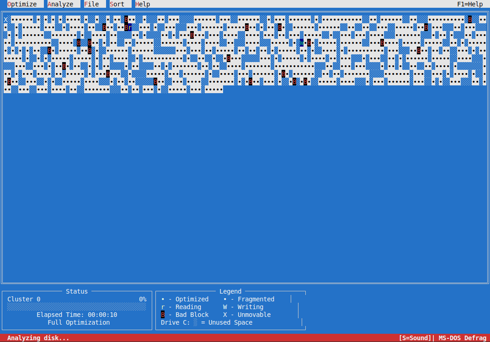
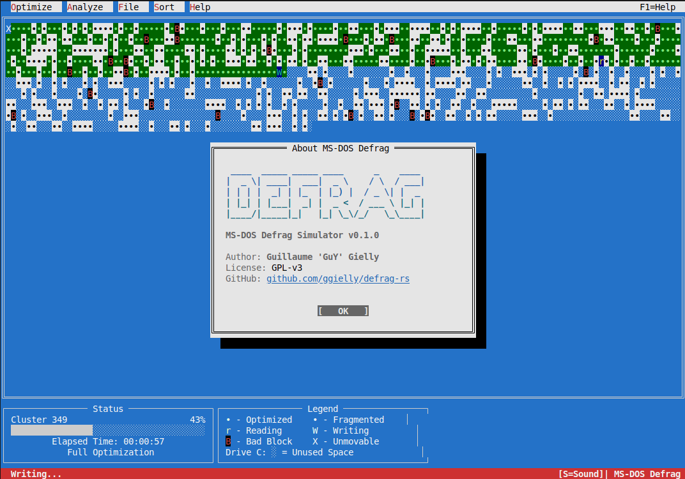

# MS-DOS 6.22 and Windows98 disk defrag simulator

Grab a drink and idle behind a smoothing experience of a DOS or Win98 disk defragmentation.

You can choose having a more relaxing defrag experience with oldschool HDD sounds based on hdd's speed : between 1 or 8 IOPS ! 

You can choose a full console experience or a graphical Win98 (Win95 coming soon).

## How to run

1. Install or have already a stable Rust toolchain + SDL2 lib devs (for win98 simulator).
1. git clone
1. cargo run or cargo build --release

On Windows, during the "cargo build" process, the SDL2.dll will be copied in the project folder \target\debug or \target\release.

### How to install SDL2 on Windows

1. Launch a terminal
1. Create a folder C:\src\vcpkg (example) and go in it
1. git clone https://github.com/Microsoft/vcpkg.git C:\vcpkg
1. cd C:\vcpkg
1. .\bootstrap-vcpkg.bat

The project config of SDL2 is in \projectfoler\.cargo\config.toml

#### Install SDL2 + SDL2_ttf

.\vcpkg install sdl2-ttf:x64-windows
.\vcpkg integrate install

### How to install SDL2 on Linux

1. apt-get install libsdl2-dev libsdl2-ttf-dev

## Contributions

They are welcome !
