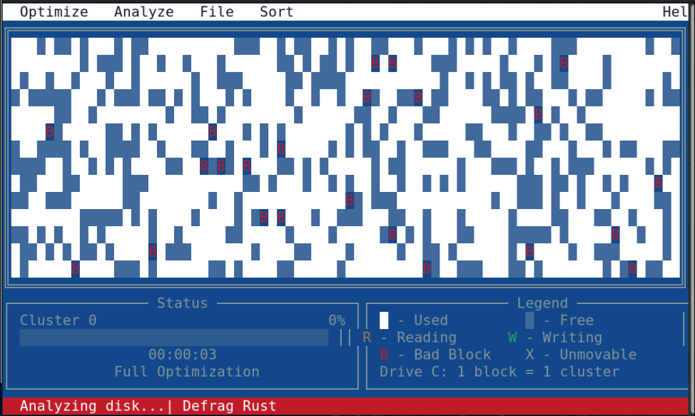

# MS-DOS 6.22 disk defrag simulator

Grab a drink and idle behind a smoothing experience of a DOS disk defragmentation.

## How to run

1. Instal or have a Rust toolchain
1. git clone
1. cargo run or cargo build

## Contributions

They are welcome !
