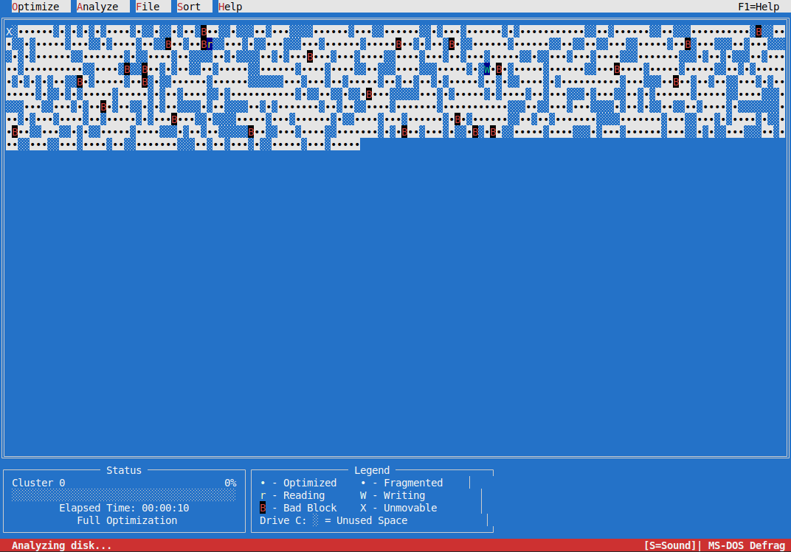
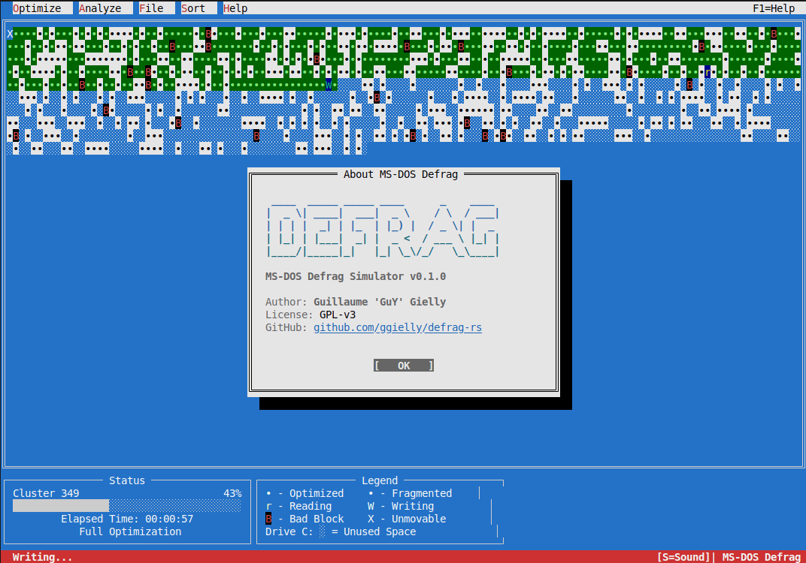

# MS-DOS 6.22 and Windows98 disk defrag simulator

Grab a drink and idle behind a smoothing experience of a DOS or Win98 disk defragmentation.

You can choose having a more relaxing defrag experience with real oldschool HDD sounds, based on hdd's speed : between 1 or 8 IOPS !

You can choose a full console experience or a graphical Win98 (Win95 coming soon).

## How to run

1. Install or have already a stable Rust toolchain + SDL2 lib devs (for win9x and following simulator).
1. git clone
1. cargo run or cargo build --release

On Windows, during the "cargo build" process, the SDL2.dll will be copied in the project folder \target\debug or \target\release.
During the build, all the assets (sounds, police, graphical) will be packed using SDL2 into the binary.

### How to install SDL2 on Windows

1. Launch a terminal
1. Create a folder C:\src\vcpkg (example) and go in it
1. git clone https://github.com/Microsoft/vcpkg.git C:\vcpkg\src
1. cd C:\src\vcpkg
1. .\bootstrap-vcpkg.bat

The project config of SDL2 is in \projectfoler\.cargo\config.toml. Do not forget to edit the path inside the config TOML if you want to change it.

#### Install SDL2 + SDL2_ttf

.\vcpkg install sdl2-ttf:x64-windows
.\vcpkg integrate install

### How to install SDL2 on Linux and ALSA lib (debian/ubuntu)

1. apt-get install libsdl2-dev libsdl2-ttf-dev libasound2-dev

## Contributions

They are welcome !
